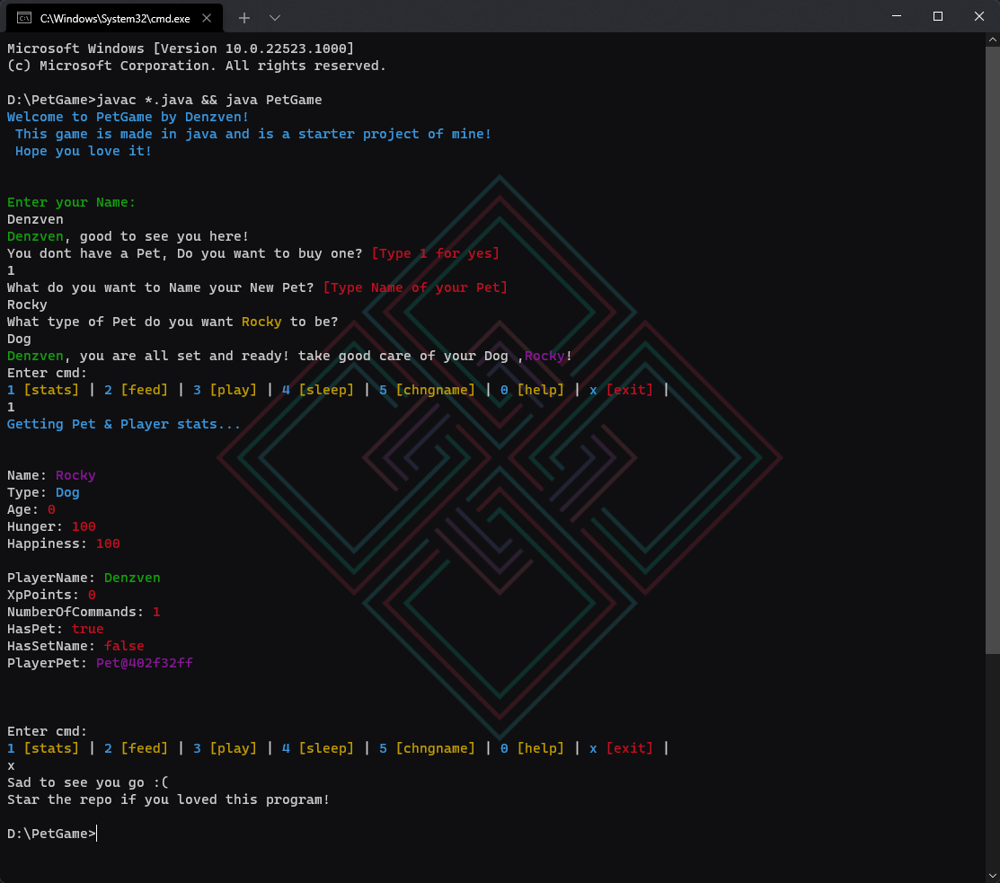
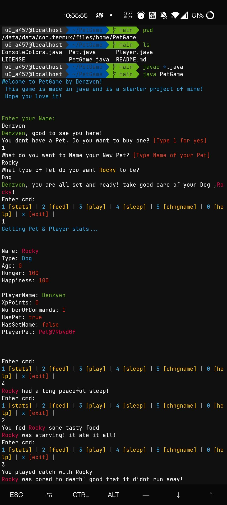
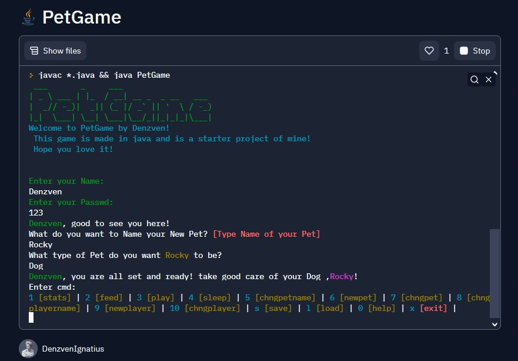

<!DOCTYPE html>
<body>
<h2> PetGame by Denzven made in Java <h2>

Well... this game was my attempt at java and OOPs in general, wanted to know more on objects and classes and what could be more basic than the simplest PetGame! 

  

Ofc I was inspired by numerous apps and programs i have seen in the past including dankmemer's pet system and all those cookie clicker type games.  

  

to run the program, have the JDK (Java Development Kit) installed and put in PATH, and run the following command ->  

<pre><code class="lang-bash">javac *.java &amp;&amp; java PetGame
</code></pre>

<a href="https://www.oracle.com/java/technologies/java-se-development-kit11-downloads.html">Download the JDK here</a>

this will compile the program using javac (JAVA Compiler) and run the compiled class file using JAVA

ScreenShots:
Yes this program is very colorful and uses ANSI colors for the terminal 

Thanks to This Answer on <a href="https://stackoverflow.com/a/45444716">StackOverFlow</a>

<table>
<tr>
<td> 
Windows Terminal: 
</td> 
    
<td> 

</td>
</tr>

<tr>
<td> 
Termux (Android): 
</td> 
  
<td> 

</td>
</tr>

<tr> 
<td>
Or try this <a href="https://replit.com/@DenzvenIgnatius/PetGame?v=1"> Online verion! </a>
</td>

<td> 

</td>
</tr>
</table>
  

 

Thank you! pls star the repo <a href="https://github.com/denzven/PetGame">⭐</a>

   

 Made with Love 💜 by Denzven and Java 🍵  

</html>